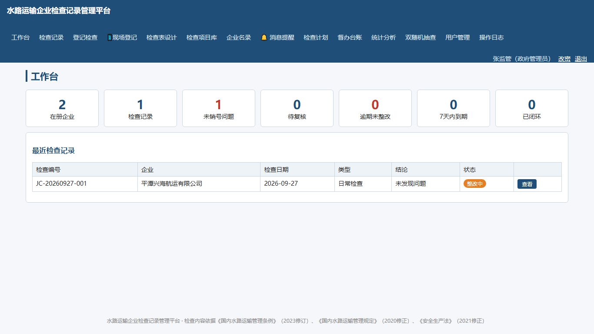
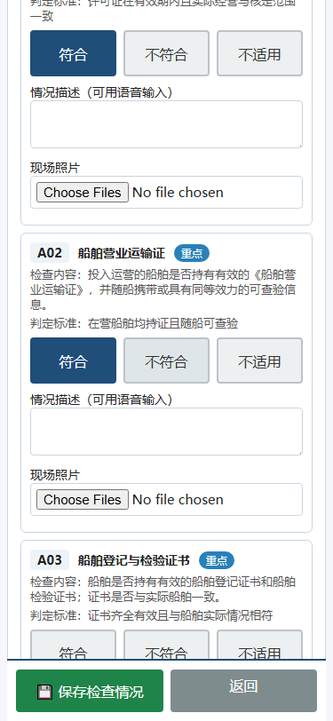
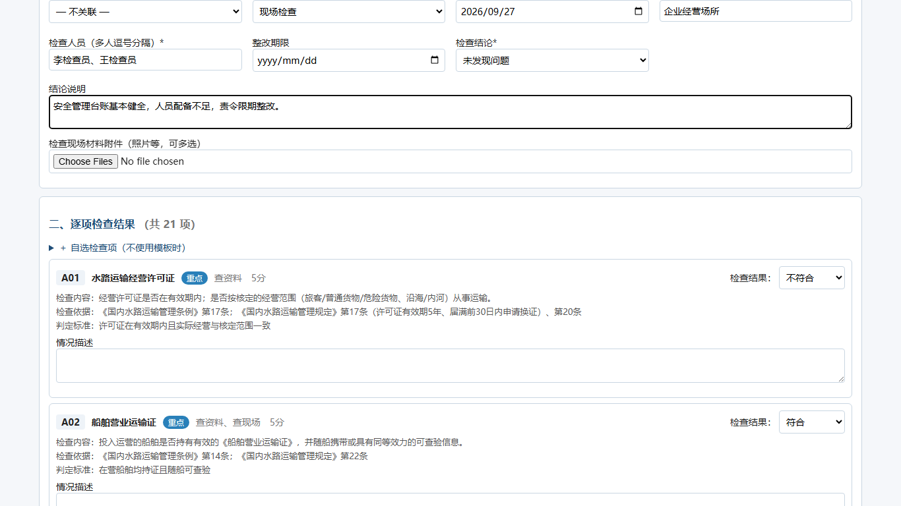
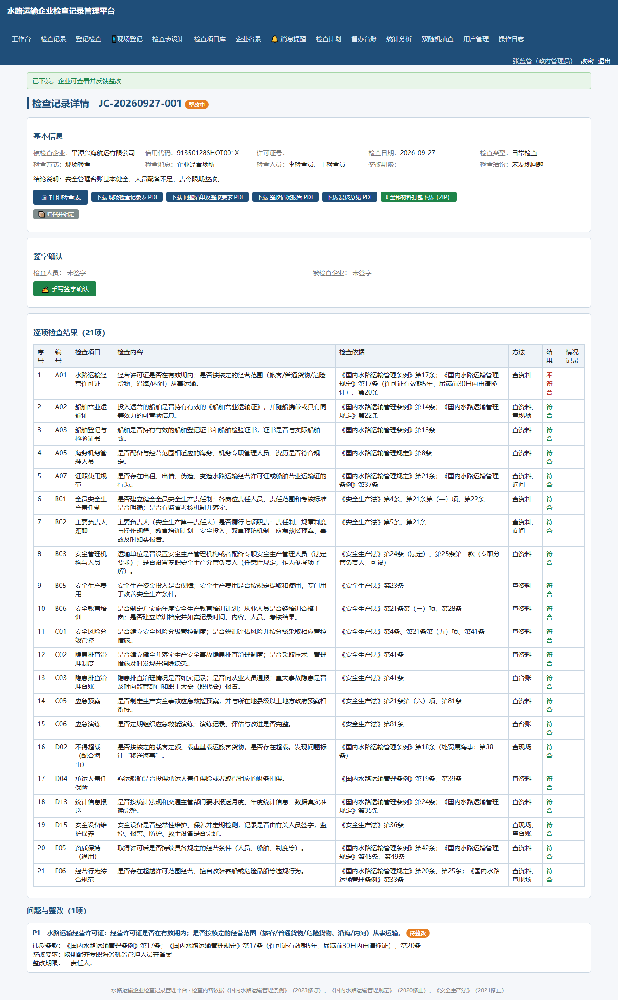
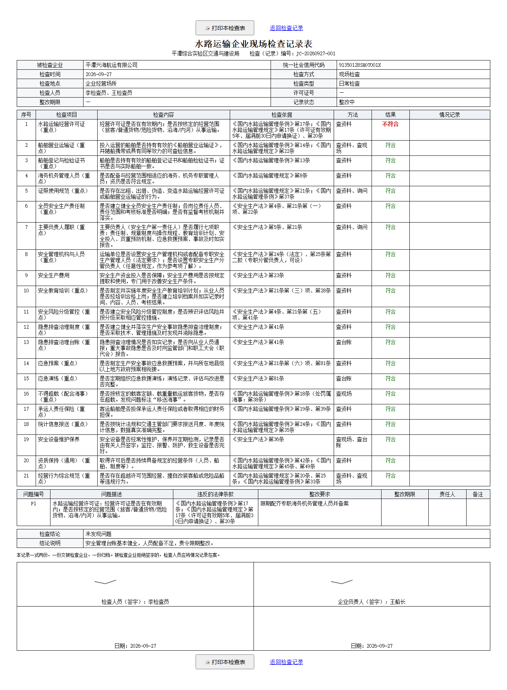
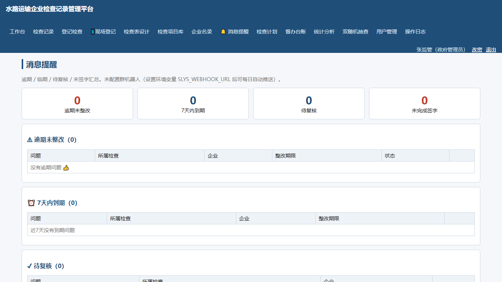

# 水路运输企业检查记录管理平台

[](https://github.com/hehf21/waterway-inspection-platform/actions/workflows/ci.yml)
[](LICENSE)

面向交通运输主管部门的 **B/S 结构监督检查记录管理系统**：检查计划 → 双随机抽查 → 现场登记（手机适配）→ 双方手写签字 → 企业整改反馈 → 复核归档，全过程材料一键打包、签字自动进文书。检查内容依据《国内水路运输管理条例》《国内水路运输管理规定》《安全生产法》等预置 **51 项检查库**（条款到条、可核对）。

Python FastAPI + SQLite 单文件实现，**零编译、双击启动、免数据库安装**，适合政务内网小规模部署。

## 功能特性

| 模块 | 能力 |
|---|---|
| 检查计划 | 年度/季度计划制定与下达、计划项分解（企业/范围/类型/家次/时段/人员）、登记关联自动核销、执行进度与导出 |
| 双随机抽查 | 随机抽取企业＋随机选派检查员、**随机种子入档可复现复核**（抽样公正）、自动生成检查草稿、免登录结果公示页（一公开） |
| 现场登记 | 手机适配逐项点选（符合/不符合/不适用）、拍照上传、语音输入情况描述、进度暂存断点恢复、漏检项强制点选 |
| 签字确认 | 被检查企业与检查人员触屏/鼠标手写签名，**签名自动嵌入文书签字栏**，A4 打印即签字件；归档锁定后禁补签 |
| 整改闭环 | 状态机（草稿→整改中→待复核→已闭环→已归档）、多轮反馈留痕、退回重报、逾期/临期督办、复核销号 |
| 归档打包 | 单条/批量 ZIP（记录表/问题清单/整改报告/复核意见/附件/结构化数据/SHA256 校验）、归档包落盘可复用、更正留痕 |
| 提醒推送 | 逾期/临期/待复核/未签字四类汇总，企微群机器人**每日定时推送**（可配） |
| 统计考核 | 按企业/类型/问题类别统计、月度考核汇总表（可打印导出）、一企一档、检查表打印与批量打印 |
| 系统安全 | 会话版本化（改密即废止旧会话）、账号×IP 限速、CSRF、CSP nonce（无 unsafe-inline）、安全响应头、操作日志（含改动前后）、归档防篡改（SHA256） |

## 界面预览

| 工作台 | 现场登记（手机 375px） |
|:---:|:---:|
|  |  |

| 登记检查（逐项点选） | 检查记录详情 | 打印检查表（含手写签名） | 消息提醒 |
|:---:|:---:|:---:|:---:|
|  |  |  |  |

> 截图由 `python make_screenshots.py` 自动生成（起隔离实例＋演示数据＋Playwright 截图，可重复生成）。

## 快速开始

> 需要 **Python 3.9+**（实测 3.12）、Node.js 仅开发期检查用到。

```bash
pip install -r requirements.txt
python app.py                 # 打开 http://127.0.0.1:8098
```

或 Windows 双击 `启动平台.bat`，或 Docker：

```bash
docker compose up -d          # http://localhost:8098，数据持久化在 ./data
```

**初始账号**（仅在空库首次启动时生成，**首次登录强制改密**）：

| 账号 | 初始密码 | 角色 |
|---|---|---|
| admin | admin@123 | 系统管理员 |
| gov | gov@123 | 政府管理员 |
| inspector | insp@123 | 政府检查员 |

企业账号由管理员创建。上线前请立即修改所有初始密码。

## 配置（环境变量，均可选）

| 变量 | 作用 | 默认 |
|---|---|---|
| `SLYS_HOST` / `SLYS_PORT` | 监听地址（外网部署设 `0.0.0.0`） | 127.0.0.1:8098 |
| `SLYS_SECRET` | 固定会话密钥（≥32位）；不设则首次启动生成 `data\secret.key` | 自动生成 |
| `SLYS_DATA` | 数据目录覆盖（多环境/测试隔离用） | `平台目录\data` |
| `SLYS_WEBHOOK_URL` | 企业微信群机器人地址（逾期提醒每日推送） | 空=不推送 |
| `SLYS_PUSH_TIME` | 每日推送时间 | 08:30 |
| `SLYS_PUBLIC_NOTICE` | 双随机结果公示页开关 | 1 |
| `SLYS_ALLOW_GOV_FEEDBACK` | 允许政府代企业录整改反馈（代录全程标注） | 1 |

## 项目结构

```
app.py              应用装配入口（中间件/健康检查/异常兜底/路由装配）
webcore.py          共享核心：鉴权/会话版本/CSRF/限速/渲染
routes_*.py         业务路由（auth/dash/enterprise/item/inspection/notify/plan/random/stats/admin）
db.py               数据模型、轻量迁移、审计、初始化（51 项检查库种子）
pdfgen/zipgen/exportgen   文书 PDF、归档 ZIP、Excel/Word 导出
db_maintenance.py   数据库体检/备份轮转/演示数据清理/VACUUM
deploy/             nginx HTTPS 样例、定时备份脚本
smoke_test.py       173 项全流程回归（隔离数据目录，跑完自动清理）
e2e_test.py         20 项浏览器级 E2E（Playwright：真实点击/签字画板/手机视口/CSP）
```

## 测试

```bash
python smoke_test.py          # 173/173 全绿为正常
```

覆盖：鉴权与会话、越权隔离、XSS/CSRF、状态机、归档锁定与更正、签字、打印、双随机种子可复现、检查计划核销、并发编号唯一、服务端校验等。

## 部署与运维

- **HTTPS**：套 `deploy/nginx-sample.conf`（替换域名与证书路径）
- **备份**：每日执行 `deploy/backup.ps1`（库热备份 30 份轮转 + 附件/密钥快照）；或管理页"一键备份"
- **体检**：每月 `python db_maintenance.py check`（完整性/孤儿数据/附件一致性）
- 数据全在 `data\` 目录（app.db / uploads / archives / secret.key），WAL 模式另有 `app.db-wal`、`app.db-shm`，备份请整目录处理

## 法规依据

检查项目库依据《国内水路运输管理条例》（国务院令第625号，2023 年第三次修订）、《国内水路运输管理规定》（交通运输部令2014年第2号，2020 年修正）、《中华人民共和国安全生产法》（2021 年修正）等设定，条款引用经联网核对；海事管理事项（超载、不适航、船员配备不足等）标注"移送海事"。

> 检查内容与条款引用仅供工作参考，具体执法以现行法律法规原文为准；发现引用错误请提 Issue。

## License

[MIT](LICENSE)
